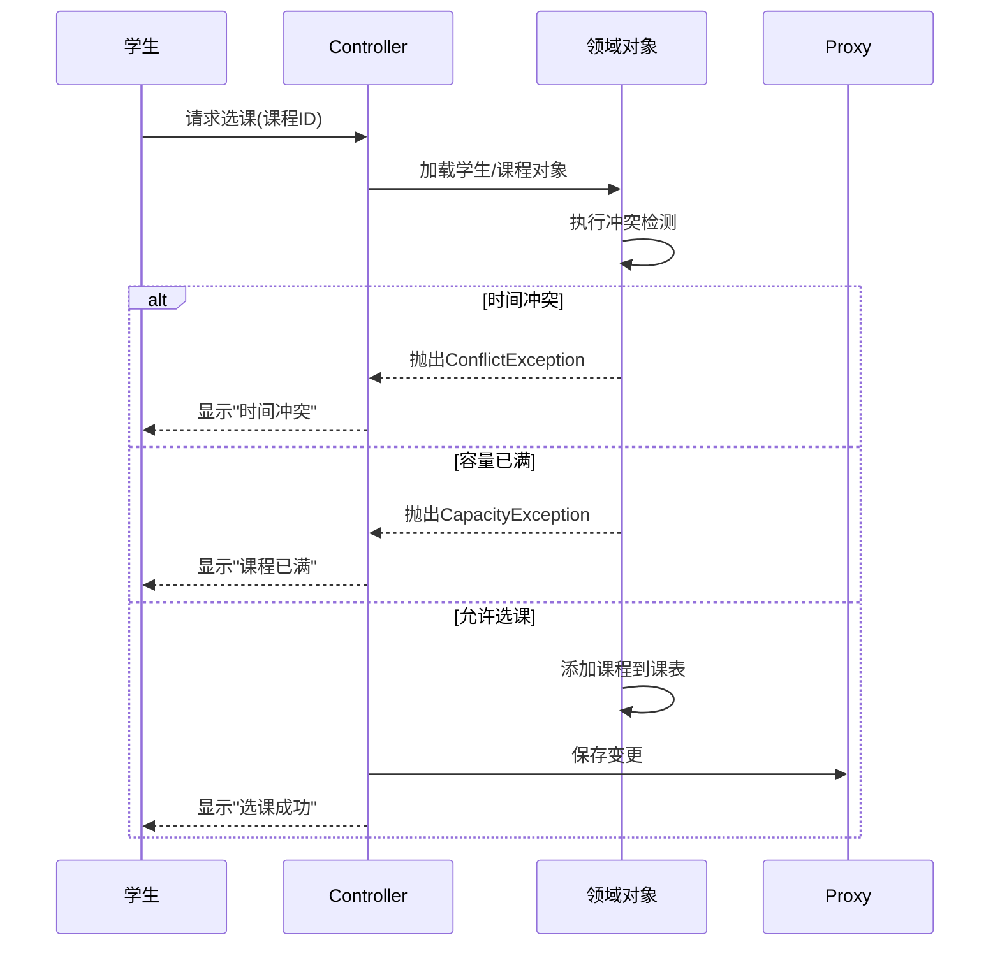
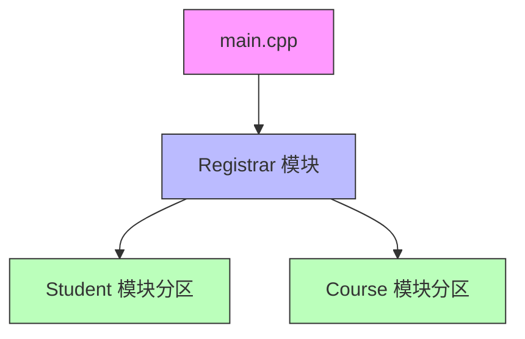
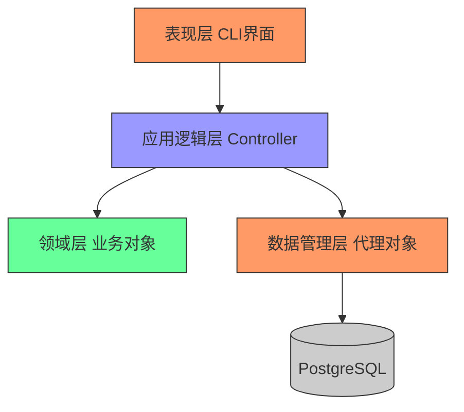
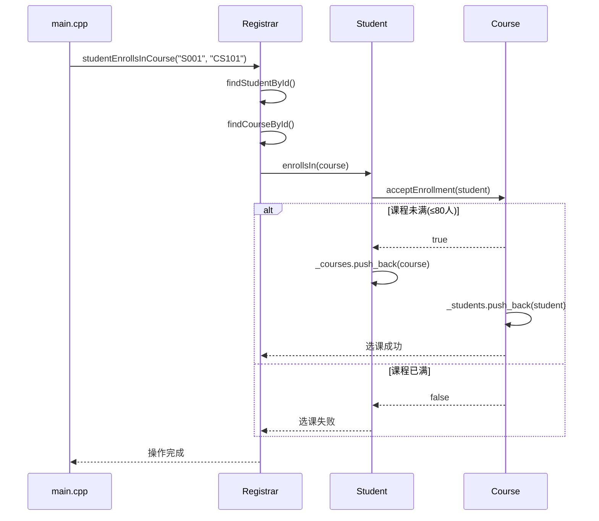
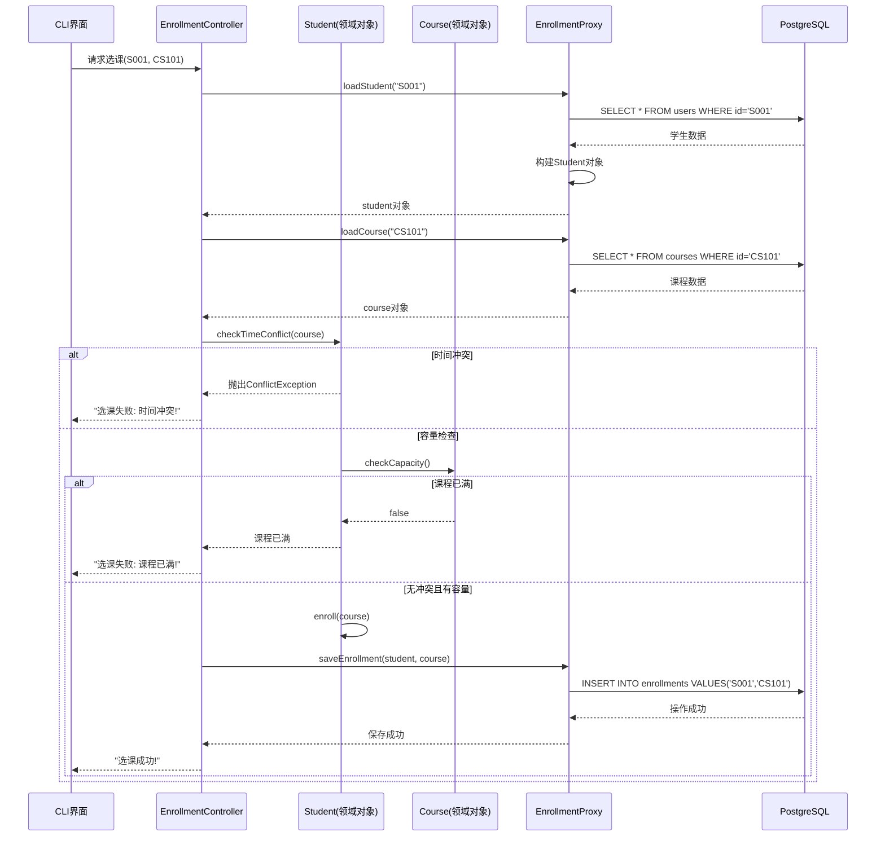

# 选课系统需求规格说明书

> **依据**：重庆师范大学2025-2026学年度第1学期《软件工程综合实训1》期末考核要求
> **提交形式**：本需求文档需存放在GitHub仓库的`doc/`目录中，作为项目核心设计依据

## 1. 系统概述

### 1.1 开发目标

实现一个**严格遵循4层架构**的选课系统，通过领域驱动设计思想将业务逻辑与数据存储分离，杜绝面向过程编程和数据库中心化设计。系统需完整支持三种角色的核心业务流，并通过代理者模式实现PostgreSQL数据持久化。

### 1.2 强制技术约束

| 层级           | 要求                                 | 禁止项                 |
| -------------- | ------------------------------------ | ---------------------- |
| **表现层**     | 基于终端的CLI菜单系统                | 不得包含业务逻辑判断   |
| **应用逻辑层** | 通过控制器对象协调各层交互           | 不得直接访问数据库     |
| **领域层**     | 纯业务对象（Student/Course/Teacher） | **严禁出现SQL语句**    |
| **数据管理层** | 代理者模式+PostgreSQL                | 不得暴露数据库连接细节 |

> 💡 **评分关键**：领域层若出现`#include <libpqxx>`或SQL字符串，本部分成绩归零

## 2. 业务需求详述

### 2.1 角色与权限

| 角色         | 权限范围     | 关键操作                             |
| ------------ | ------------ | ------------------------------------ |
| **教学秘书** | 课程管理权   | ① 创建课程 ② 分配教师 ③ 设置上课时间 |
| **学生**     | 个人课表管理 | ① 选/退课 ② 查看课表 ③ 查看成绩      |
| **教师**     | 教学任务管理 | ① 查看授课名单 ② 录入/修改成绩       |

### 2.2 核心业务规则

#### 2.2.1 课程发布（教学秘书）

- **时间冲突检测**：同一教师在同一时间段（如周一3-4节）只能安排一门课程
- **容量控制**：单门课程最大容量≤60人
- **数据要求**：课程记录必须包含唯一ID、名称、学分、教师ID、时间槽

#### 2.2.2 选课流程（学生）



#### 2.2.3 成绩管理（教师）

- 仅可查看/修改本人授课课程的成绩
- 成绩范围：0-100分（整数）
- 修改需记录操作日志（控制台输出即可）

## 3. 系统架构规范

### 3.1 4层架构实现要求

```plaintext
src/
├── presentation/   # 表现层（终端UI）
│   ├── LoginMenu.cpp
│   └── StudentMenu.cpp
├── application/    # 应用逻辑层（控制器）
│   ├── SystemController.cpp
│   └── EnrollmentController.cpp
├── domain/         # 领域层（纯业务对象）
│   ├── Student.cpp
│   ├── Course.cpp
│   └── TimeSlot.cpp  # 必须包含overlaps()方法
└── infrastructure/ # 数据管理层（代理模式）
    ├── PostgresProxy.cpp  # 连接池管理
    ├── StudentProxy.cpp   # 实现find/save
    └── CourseProxy.cpp
```

### 3.2 代理者模式实现规范

```cpp
// 数据管理层示例 (infrastructure/StudentProxy.h)
class StudentProxy {
private:
    PostgresConnection* db;
public:
    Student* findById(const string& id) {
        // 1. 执行SQL查询获取基础数据
        // 2. 创建Student对象
        // 3. 执行JOIN查询加载已选课程
        // 4. 组装完整对象返回
        return new Student(...); 
    }
    
    void save(Student* student) {
        // 1. 拆解对象状态
        // 2. 生成UPDATE/INSERT语句
        // 3. 事务提交
    }
};

// 领域层严禁出现此类代码（示例反面教材）
class Student {
    void badPractice() {
        // ❌ 严重违规：领域层直接操作数据库
        pqxx::connection conn("dbname=course");
        pqxx::work txn(conn);
        txn.exec("UPDATE ...");
    }
};
```

## 4. 数据库设计

### 4.1 核心表结构

```sql
CREATE TABLE users (
    user_id VARCHAR(20) PRIMARY KEY,
    name VARCHAR(50) NOT NULL,
    password VARCHAR(50) DEFAULT '123456',
    role VARCHAR(20) CHECK (role IN ('student','teacher','secretary'))
);

CREATE TABLE courses (
    course_id VARCHAR(20) PRIMARY KEY,
    name VARCHAR(50) NOT NULL,
    credit INTEGER NOT NULL,
    capacity INTEGER NOT NULL,
    teacher_id VARCHAR(20) REFERENCES users(user_id),
    weekday INTEGER NOT NULL,  -- 1=周一,5=周五
    timeslot INTEGER NOT NULL  -- 1=(1-2节),2=(3-4节)...
);

CREATE TABLE enrollments (
    student_id VARCHAR(20) REFERENCES users(user_id),
    course_id VARCHAR(20) REFERENCES courses(course_id),
    score INTEGER,
    PRIMARY KEY (student_id, course_id)
);
```

### 4.2 代理层映射要求

| 领域对象  | 代理类         | 关键方法                  |
| --------- | -------------- | ------------------------- |
| `Student` | `StudentProxy` | `findWithEnrollments(id)` |
| `Course`  | `CourseProxy`  | `findWithSchedule(id)`    |
| `Teacher` | `UserProxy`    | `findTeachers()`          |

> 📌 **必须实现**：加载学生时需通过JOIN查询同时获取已选课程（避免N+1查询问题）

## 5. 开发与交付要求

### 5.1 Git版本控制规范

```bash
# 仓库结构示例
your-repo/
├── doc/               # 存放本需求文档
│   └── requirements.md
├── src/               # 源代码
├── CMakeLists.txt
└── .gitignore
```

- 分支策略

  ：

  - `dev`分支：日常开发（含doc目录）
  - `release/v1.0`：最终提交版本

- 提交要求

  ：

  - 每人≥3次有效提交（含代码/文档）
  - 提交信息需描述功能点（如"feat: implement time conflict detection"）

### 5.2 交付物清单

| 项目     | 位置                  | 要求                                                         |
| -------- | --------------------- | ------------------------------------------------------------ |
| 源代码   | GitHub仓库根目录      | 能通过CMake编译                                              |
| 需求文档 | `doc/requirements.md` | 包含UML类图截图                                              |
| 展示视频 | 仓库根目录            | ≤50MB，OBS录制                                               |
| 设计说明 | `doc/design_notes.md` | 重点描述： ① 4层架构实现细节 ② 代理者模式应用 ③ 冲突检测算法 |

### 5.3 演示重点

1. **系统运行**：通过系统应用菜单启动（非IDE直接运行）

2. 核心场景演示

   ：

   - 教学秘书：创建两门时间冲突的课程 → 系统阻止操作
   - 学生：尝试选择时间冲突的课程 → 显示明确错误
   - 教师：为学生录入成绩 → 验证数据持久化

3. 架构验证

   ：

   - 展示领域层代码无SQL痕迹
   - 展示代理类如何封装数据访问

## 6. 附录：UML类模型规范

> **（本部分需在`doc/design_notes.md`中提供截图）**

### 6.1 领域层核心类图

```mermaid
classDiagram
    direction LR
    
    namespace ModuleCoursesys {
        class User {
            <<abstract>>
            #string userId
            #string name
            #string password
            #string role
            +User(string, string, string, string)
            +authenticate(string) bool
            +getRole() string
            +virtual ~User()
        }
        
        class Student {
            -vector~Enrollment*~ enrollments
            +Student(string, string, string)
            +enroll(Course*) bool
            +drop(Course*) bool
            +hasTimeConflict(Course*) bool
            +getSchedule() vector~Course*~
            +~Student()
        }
        
        class Teacher {
            -vector~Course*~ teachingCourses
            +Teacher(string, string, string)
            +assignGrade(Enrollment*, int) bool
            +getTeachingCourses() vector~Course*~
            +~Teacher()
        }
        
        class Secretary {
            +Secretary(string, string, string)
            +createCourse(string, string, int, int, Teacher*, TimeSlot*) bool
            +assignTeacherToCourse(Course*, Teacher*) bool
            +~Secretary()
        }
        
        class Course {
            -string courseId
            -string name
            -int credit
            -int capacity
            -Teacher* teacher
            -TimeSlot* timeSlot
            -vector~Enrollment*~ enrollments
            +Course(string, string, int, int, Teacher*, TimeSlot*)
            +isFull() bool
            +getEnrollmentCount() int
            +getTimeSlot() TimeSlot*
            +~Course()
        }
        
        class TimeSlot {
            -int weekday
            -int period
            +TimeSlot(int, int)
            +overlaps(TimeSlot*) bool
            +toString() string
        }
        
        class Enrollment {
            -Student* student
            -Course* course
            -int grade
            +Enrollment(Student*, Course*)
            +setGrade(int) void
            +getGrade() int
            +getStudent() Student*
            +getCourse() Course*
        }
        
        class EnrollmentController {
            +enrollStudent(string, string) bool
            +dropCourse(string, string) bool
            +getStudentSchedule(string) vector~Course*~
            +validateEnrollment(Student*, Course*) vector~string
        }
        
        class GradeController {
            +updateGrade(string, string, int) bool
            +getCourseGrades(string) map~string, int~
        }
        
        class CourseController {
            +createCourse(Secretary*, CourseData) bool
            +assignTeacher(string, string) bool
            +getAvailableCourses() vector~Course*~
        }
        
        class StudentProxy {
            -PostgresConnection* connection
            +findById(string) Student*
            +save(Student*) bool
            +findWithEnrollments(string) Student*
        }
        
        class CourseProxy {
            -PostgresConnection* connection
            +findById(string) Course*
            +save(Course*) bool
            +findWithSchedule(string) Course*
        }
        
        class EnrollmentProxy {
            -PostgresConnection* connection
            +saveEnrollment(Enrollment*) bool
            +findByStudentAndCourse(string, string) Enrollment*
            +findByCourse(string) vector~Enrollment*~
        }
        
        class MenuSystem {
            +showMainMenu() void
            +showStudentMenu(Student*) void
            +showTeacherMenu(Teacher*) void
            +showSecretaryMenu(Secretary*) void
            +getUserInput() string
        }
        
        class LoginManager {
            +authenticate(string, string) User*
            +logout() void
        }
    }
    
    %% 继承关系
    User <|-- Student
    User <|-- Teacher
    User <|-- Secretary
    
    %% 领域层关系
    Student "1" --> "0..*" Enrollment : has
    Course "1" --> "0..*" Enrollment : has
    Enrollment --> "1" Student : references
    Enrollment --> "1" Course : references
    Course --> "1" TimeSlot : contains
    Teacher "1" --> "0..*" Course : teaches
    
    %% 应用层依赖关系
    EnrollmentController --> StudentProxy : uses
    EnrollmentController --> CourseProxy : uses
    EnrollmentController --> EnrollmentProxy : uses
    
    %% 代理层与领域层关系
    StudentProxy ..> Student : creates/manages
    CourseProxy ..> Course : creates/manages
    EnrollmentProxy ..> Enrollment : creates/manages
    
    %% 表现层关系
    MenuSystem --> EnrollmentController : delegates to
    MenuSystem --> GradeController : delegates to
    MenuSystem --> CourseController : delegates to
    
    %% 添加注释说明
    note for User "基类分区: coursesys:domain.base"
    note for Student "学生分区: coursesys:domain.student"
    note for Teacher "教师分区: coursesys:domain.teacher"
    note for Secretary "教学秘书分区: coursesys:domain.secretary"
    note for Course "课程分区: coursesys:domain.course"
    note for TimeSlot "时间槽分区: coursesys:domain.timeslot"
    note for Enrollment "选课关系分区: coursesys:domain.enrollment"
    note for EnrollmentController "选课控制器分区: coursesys:application.enrollment_ctrl"
    note for GradeController "成绩控制器分区: coursesys:application.grade_ctrl"
    note for CourseController "课程控制器分区: coursesys:application.course_ctrl"
    note for StudentProxy "学生代理分区: coursesys:infrastructure.student_proxy"
    note for CourseProxy "课程代理分区: coursesys:infrastructure.course_proxy"
    note for EnrollmentProxy "选课代理分区: coursesys:infrastructure.enrollment_proxy"
    note for MenuSystem "菜单系统分区: coursesys:presentation.menu_system"
    note for LoginManager "登录管理器分区: coursesys:presentation.login_manager"
```



**关键关系**：

- `Student`与`Course`通过`Enrollment`多对多关联
- `Course`组合包含`TimeSlot`对象
- `TimeSlot`必须实现`bool overlaps(TimeSlot other)`方法

### 6.2 代理模式交互

```plaintext
+----------------+      +---------------+      +-----------------+
|  Controller    |----->|  StudentProxy |----->| PostgreSQL      |
+----------------+      +---------------+      | (libpqxx)       |
| (调用save())   |      | (转换对象/SQL)|      +-----------------+
+----------------+      +---------------+
```

------


# 选课系统对比分析：当前实现 vs 功能完善版

## 1. 系统架构对比

### 1.1 当前系统架构



- **单层设计**：所有功能集中在Registrar模块及分区
- **内存存储**：无持久化机制，数据仅存在于程序运行期间
- **模块化**：使用C++23 Modules实现编译时模块分离

### 1.2 功能完善版架构



- **严格4层架构**：各层职责分明，单向依赖
- **数据持久化**：通过代理模式连接PostgreSQL
- **关注点分离**：业务逻辑与数据访问完全解耦

## 2. 选课流程对比

### 2.1 当前系统选课流程



### 2.2 功能完善版选课流程



## 3. 关键区别总结

| 对比维度     | 当前系统                 | 功能完善版系统                           |
| ------------ | ------------------------ | ---------------------------------------- |
| **架构设计** | 模块分区架构             | 严格4层架构(表现层/应用层/领域层/数据层) |
| **数据存储** | 内存对象，程序结束即丢失 | PostgreSQL持久化存储                     |
| **访问模式** | 直接对象操作             | 代理者模式(Proxy Pattern)封装数据访问    |
| **业务规则** | 仅检查容量限制(80人)     | 增加时间冲突检测、角色权限控制           |
| **用户交互** | 硬编码在main函数中       | CLI菜单系统，支持运行时交互              |
| **角色支持** | 无角色区分               | 三种角色(学生/教师/教学秘书)及权限控制   |
| **扩展性**   | 难以扩展新功能           | 各层解耦，易于扩展(如添加成绩管理)       |
| **技术栈**   | C++23 Modules            | C++23 + libpqxx + 代理模式               |

## 4. 领域模型演进

### 4.1 当前系统领域模型



### 4.2 功能完善版领域模型



## 5. 关键技术演进路径

1. **从内存到持久化**:

   - 当前：`new Student()` 创建内存对象
   - 完善版：`StudentProxy::findById()` 从数据库加载对象

2. **从简单规则到复杂业务逻辑**:

   ```cpp
   // 当前系统 - 仅检查容量
   bool Course::acceptEnrollment(Student* s) {
       return _students.size() < 80; 
   }
   
   // 完善版 - 多维度验证
   bool Student::canEnroll(Course* c) {
       if (c->isFull()) return false;
       if (hasTimeConflict(c)) return false;
       if (alreadyEnrolled(c)) return false;
       return true;
   }
   ```

3. **从单角色到多角色权限控制**:

   - 当前：无权限概念，所有操作平等
   - 完善版：实现基于角色的访问控制(RBAC)

4. **从硬编码到动态交互**:

   - 当前：所有操作在main函数中硬编码
   - 完善版：动态CLI菜单，支持运行时用户决策
